# MQTT Integration Design Document

## 概要

AITuberKitのMQTTブローカー統合機能の設計書です。MQTT機能のOn/Off切り替えによる接続・切断処理、ログ出力、ClientID管理の実装について記載します。

## アーキテクチャ

### コンポーネント構成

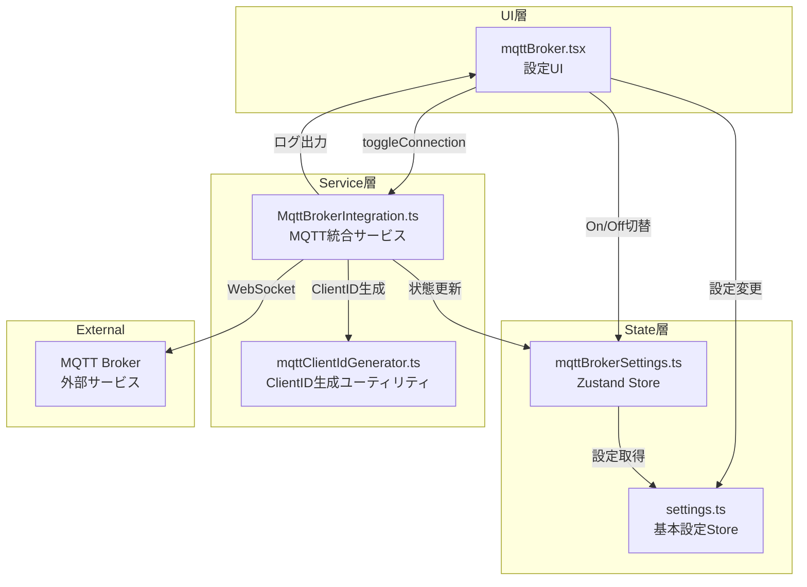

## MQTT接続フロー

### アプリケーション起動時のシーケンス

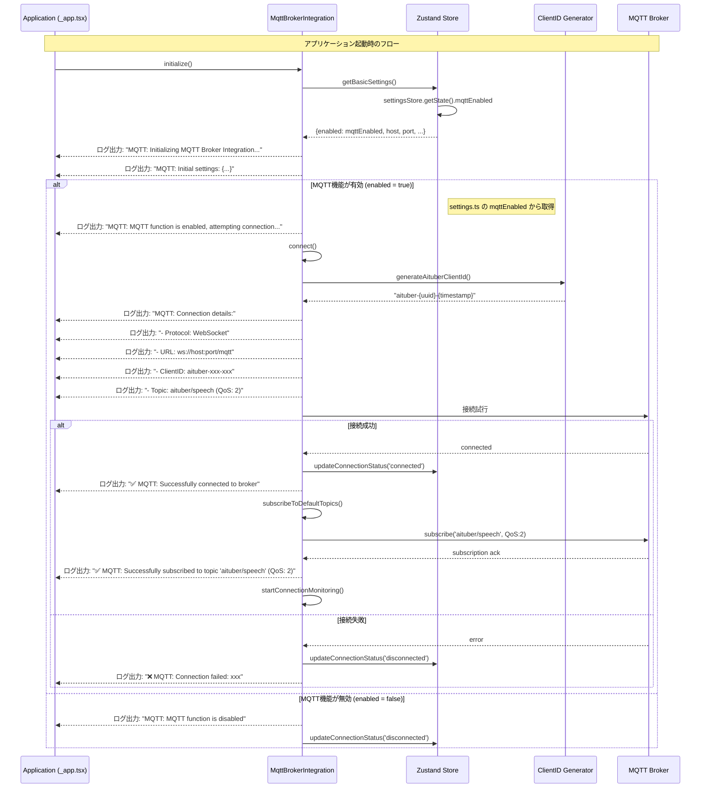

### On/Off切り替えシーケンス

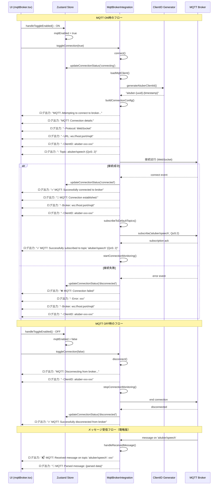

### ペイロード受信時の詳細シーケンス

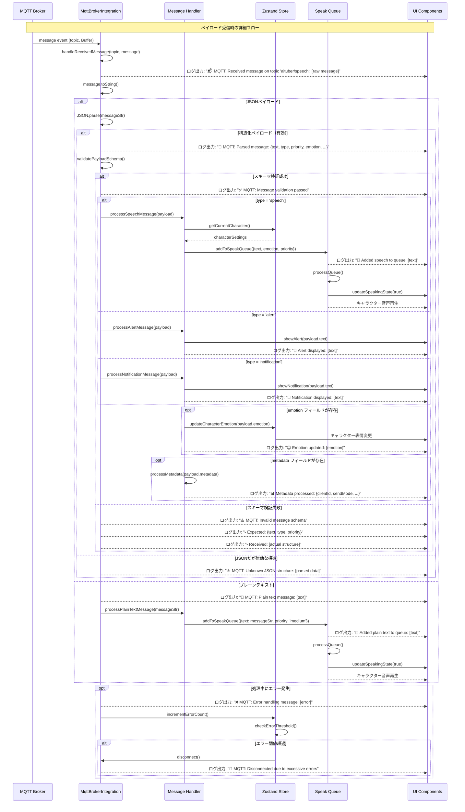

## 実装詳細

### 1. ClientID管理

#### ClientID生成ユーティリティ (mqttClientIdGenerator.ts)

```typescript
import { v4 as uuidv4 } from 'uuid'

/**
 * AITuber用の一意なMQTT ClientIDを生成
 * 形式: aituber-{uuid}-{timestamp}
 */
export function generateAituberClientId(): string {
  const uuid = uuidv4()
  const timestamp = Date.now()
  return `aituber-${uuid}-${timestamp}`
}

/**
 * ClientIDがAITuber形式かどうかを判定
 */
export function isAituberClientId(clientId: string): boolean {
  const aituberPattern = /^aituber-[0-9a-f]{8}-[0-9a-f]{4}-[0-9a-f]{4}-[0-9a-f]{4}-[0-9a-f]{12}-\d+$/
  return aituberPattern.test(clientId)
}

/**
 * ClientIDからタイムスタンプを抽出
 */
export function extractTimestampFromClientId(clientId: string): number | null {
  if (!isAituberClientId(clientId)) {
    return null
  }
  const parts = clientId.split('-')
  const timestampStr = parts[parts.length - 1]
  const timestamp = parseInt(timestampStr, 10)
  return isNaN(timestamp) ? null : timestamp
}
```

#### ClientIDの管理ロジック

```typescript
// MqttBrokerIntegration.ts での ClientID 管理
public buildConnectionConfig(): MqttConnectionConfig {
  const basicSettings = store.getBasicSettings()
  
  // ClientIDの決定ロジック
  let clientId: string
  if (basicSettings.clientId && isAituberClientId(basicSettings.clientId)) {
    // 既存の有効なAITuber形式のClientIDを使用
    clientId = basicSettings.clientId
    console.log(`MQTT: Using existing ClientID: ${clientId}`)
  } else {
    // 新規生成または既存IDを変換
    clientId = basicSettings.clientId
      ? convertLegacyClientId(basicSettings.clientId)
      : generateAituberClientId()
    console.log(`MQTT: Generated new ClientID: ${clientId}`)
    // 新しいClientIDを保存（localStorage永続化）
    settingsStore.setState({ mqttClientId: clientId })
  }
  
  return { ...config, clientId }
}
```

#### ClientIDの特徴

- **一意性保証**: UUID v4 + タイムスタンプで完全な一意性を保証
- **永続化**: 有効なClientIDはlocalStorageに保存され、再利用される
- **セッション継続性**: 同一のClientIDを使用することでブローカー側のセッションを維持
- **自動移行**: レガシー形式のClientIDは自動的にAITuber形式に変換
- **命名規則**: `aituber-`プレフィックスでAITuberクライアントを識別

#### ClientID再生成機能

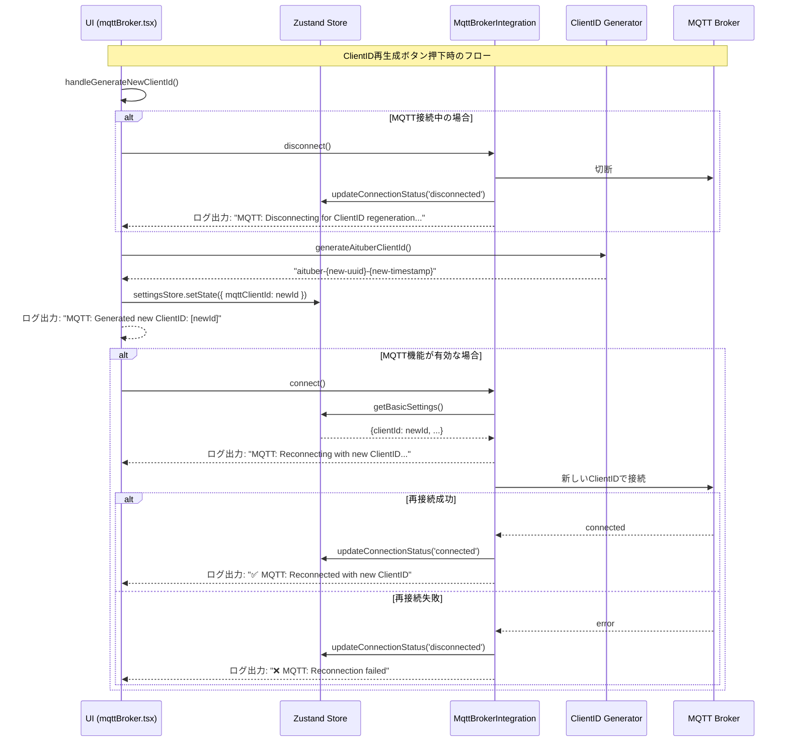

```typescript
// UI層 (mqttBroker.tsx) での実装
const handleGenerateNewClientId = useCallback(async () => {
  // 接続中の場合は一旦切断
  if (connectionStatus === 'connected') {
    console.log('MQTT: Disconnecting for ClientID regeneration...')
    await mqttBrokerIntegration.disconnect()
  }
  
  // 新しいClientIDを生成
  const newClientId = generateAituberClientId()
  settingsStore.setState({ mqttClientId: newClientId })
  console.log(`MQTT: Generated new ClientID: ${newClientId}`)
  
  // MQTT機能が有効な場合は再接続
  if (enabled) {
    console.log('MQTT: Reconnecting with new ClientID...')
    const success = await mqttBrokerIntegration.connect()
    if (success) {
      console.log('✅ MQTT: Reconnected with new ClientID')
    } else {
      console.error('❌ MQTT: Reconnection failed')
    }
  }
}, [connectionStatus, enabled])
```

### 2. MQTT接続確認と接続タイミング

#### MQTT接続確認方法

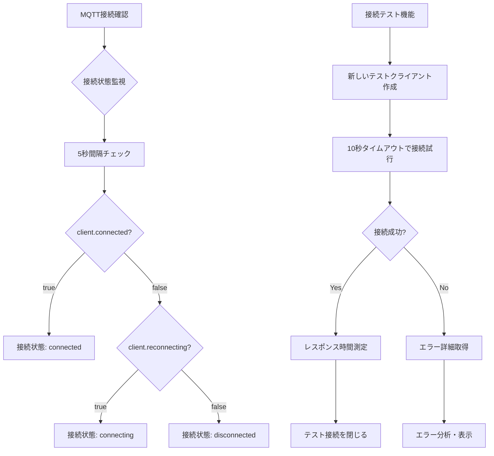

**接続監視の実装：**
```typescript
// MqttBrokerIntegration.ts
private checkConnectionStatus(): void {
  const store = useMqttBrokerStore.getState()
  const basicSettings = store.getBasicSettings()

  if (!basicSettings.enabled) {
    store.updateConnectionStatus('disconnected')
    return
  }

  // 実際の接続状態をチェック
  if (this.client && this.client.connected) {
    store.updateConnectionStatus('connected')
  } else if (this.client && this.client.reconnecting) {
    store.updateConnectionStatus('connecting')
  } else {
    store.updateConnectionStatus('disconnected')
  }
}

// 5秒間隔で監視を開始
public startConnectionMonitoring(): void {
  this.connectionCheckInterval = setInterval(() => {
    this.checkConnectionStatus()
  }, 5000)
}
```

**接続テストの実装：**
```typescript
// MqttBrokerIntegration.ts
public async testConnection(config: MqttConnectionConfig): Promise<MqttTestResult> {
  const startTime = Date.now()
  
  try {
    // 設定の妥当性チェック
    const validation = this.validateConfig(config)
    if (!validation.valid) {
      throw new Error(`設定エラー: ${validation.errors.join(', ')}`)
    }

    // テスト用の一時的な接続を作成（10秒タイムアウト）
    const testClientId = generateAituberClientId()
    const client = await this.createTestConnection(mqtt, {
      ...config,
      clientId: testClientId,
    })

    const latency = Date.now() - startTime
    
    // テスト接続を閉じる
    await this.closeTestConnection(client)
    
    return {
      success: true,
      message: `接続に成功しました (${latency}ms)`,
      latency,
    }
  } catch (error) {
    const latency = Date.now() - startTime
    const errorInfo = analyzeMqttError(error as Error)
    const detailedMessage = formatMqttError(errorInfo)
    
    return {
      success: false,
      message: detailedMessage,
      latency,
      error: error instanceof Error ? error : new Error('Unknown error'),
    }
  }
}
```

#### UI接続・切断タイミング

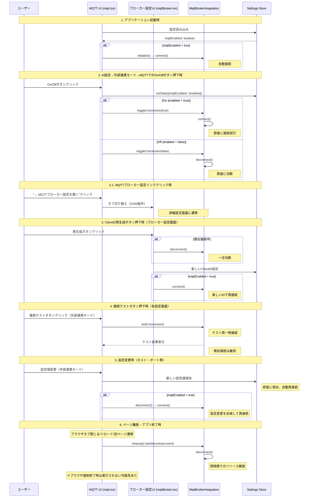

#### 接続状態の表示

**UI上での接続状態表示：**
- **Disconnected (切断中)**: グレー - "未接続"
- **Connecting (接続中)**: 黄色 - "接続中..."
- **Connected (接続済み)**: 緑色 - "接続済み"
- **Error (エラー)**: 赤色 - "エラー"

**自動更新タイミング：**
- 接続状態チェック: 5秒間隔
- UI状態反映: 即座（Zustand storeの変更を監視）
- 再接続試行: 設定された間隔（指数バックオフ）

#### ページ離脱時の処理詳細

**対象となるイベント:**
1. **ブラウザタブを閉じる** (`window.close()` または ×ボタン)
2. **ページリロード** (F5, Ctrl+R)
3. **別ページへの遷移** (URL変更、リンククリック)
4. **ブラウザ終了** (Alt+F4, プロセス終了)

**実装方法と制限:**

```typescript
// _app.tsx または適切なコンポーネント
useEffect(() => {
  const handleBeforeUnload = (event: BeforeUnloadEvent) => {
    // 同期的な処理のみ実行可能（時間制限あり）
    mqttBrokerIntegration.cleanup()
    
    // 非同期処理は実行されない可能性が高い
    // await mqttBrokerIntegration.disconnect() // ← これは動作しない
  }

  const handleUnload = (event: Event) => {
    // さらに制限が厳しい、基本的にログ送信程度のみ
    navigator.sendBeacon('/api/disconnect', JSON.stringify({
      clientId: mqttClientId,
      timestamp: Date.now()
    }))
  }

  window.addEventListener('beforeunload', handleBeforeUnload)
  window.addEventListener('unload', handleUnload)

  return () => {
    window.removeEventListener('beforeunload', handleBeforeUnload)
    window.removeEventListener('unload', handleUnload)
  }
}, [])
```

**実際の制限事項:**

```mermaid
flowchart TD
    A[ページ離脱イベント] --> B{イベントタイプ}
    
    B -->|beforeunload| C[同期処理のみ<br/>100-200ms制限]
    B -->|unload| D[さらに厳しい制限<br/>sendBeacon程度]
    B -->|pagehide| E[モバイルで有効<br/>バックグラウンド遷移]
    
    C --> F{MQTT切断処理}
    F -->|同期的切断| G[✅ 実行可能<br/>client.end(false)]
    F -->|非同期切断| H[❌ 実行されない<br/>await disconnect()]
    
    D --> I[❌ MQTT処理不可]
    E --> J[📱 モバイル対応]
    
    K[ブラウザ強制終了] --> L[❌ イベント発火せず]
    M[タスクマネージャー終了] --> L
    N[電源断] --> L
```

**実用的な実装方針:**

```typescript
// MqttBrokerIntegration.ts
public cleanup(): void {
  console.log('MQTT: Cleaning up resources...')
  
  // 接続監視を停止（同期処理）
  this.stopConnectionMonitoring()

  if (this.client) {
    try {
      // 同期的な切断（force=true）
      this.client.end(true) // 強制的に即座に切断
      console.log('MQTT: Emergency disconnect completed')
    } catch (error) {
      console.warn('MQTT: Error during emergency cleanup:', error)
    }
    this.client = null
  }

  // 状態をリセット
  const store = useMqttBrokerStore.getState()
  store.updateConnectionStatus('disconnected')
}

// 通常の切断処理（時間をかけられる場合）
public async disconnect(): Promise<void> {
  console.log('MQTT: Graceful disconnect...')
  
  this.stopConnectionMonitoring()

  if (this.client) {
    return new Promise((resolve) => {
      try {
        // graceful disconnect（時間がかかる可能性）
        this.client.end(false, {}, () => {
          console.log('✅ MQTT: Graceful disconnect completed')
          this.client = null
          resolve()
        })
      } catch (error) {
        console.warn('⚠️ MQTT: Error during graceful disconnect:', error)
        this.client = null
        resolve()
      }
    })
  }
}
```

**実際の動作:**

| イベント | 実行可能性 | 実行される処理 |
|---------|-----------|---------------|
| タブ閉じる | 🟡 部分的 | 同期的リソース解放のみ |
| ページリロード | 🟡 部分的 | 同期的リソース解放のみ |
| 別ページ遷移 | ✅ 実行可能 | 通常の切断処理 |
| ブラウザ終了 | 🟡 部分的 | 同期的リソース解放のみ |
| 強制終了 | ❌ 実行されず | 何も実行されない |

**結論:**
ページ離脱時の処理は**制限付きで実行可能**ですが、完全な切断処理は保証されません。MQTTブローカー側では接続タイムアウト（Keep Alive）により、クライアントの異常切断を検出して接続を閉じます。

### 3. MQTT音声合成システム連携

#### 受信メッセージから音声合成への変換フロー

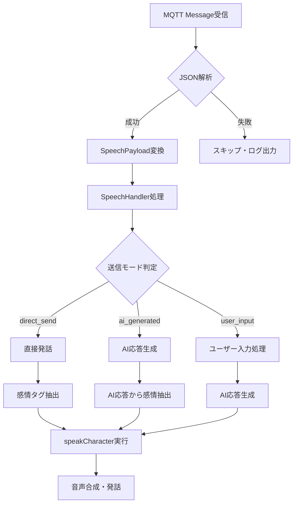

**実装詳細:**
```typescript
// MQTT受信メッセージの処理
private async handleReceivedMessage(topic: string, message: Buffer): Promise<void> {
  const messageStr = message.toString()
  const parsedMessage = JSON.parse(messageStr)
  
  // SpeechPayload形式に変換
  const speechPayload: SpeechPayload = {
    id: parsedMessage.id || `mqtt-${Date.now()}`,
    text: parsedMessage.text || messageStr,
    type: parsedMessage.type || 'speech',
    emotion: parsedMessage.emotion || undefined,
    priority: parsedMessage.priority || 'medium',
  }
  
  // SpeechHandlerで音声合成・発話を実行
  const result = await this.speechHandler.handleSpeechPayload(speechPayload)
}
```

#### 音声合成モード

1. **direct_send**: 受信メッセージをそのまま発話
   - 感情タグ `[happy]` 自動抽出
   - テキストサニタイズ処理
   - VOICEVOX対応文字数制限（200文字）

2. **ai_generated**: AIが自然な発話に変換
   - プロンプト: 「以下のメッセージを自然で親しみやすい話し方に変換」
   - AI応答ストリーミング処理
   - フォールバック: direct_sendモードに切り替え

3. **user_input**: ユーザー入力として扱いAI応答
   - 受信メッセージをユーザー発言として処理
   - AIがシステムプロンプトに基づいて応答
   - デフォルト応答: 「すみません、よく理解できませんでした」

#### 優先度制御

- **high**: 全発話を中断して即座に処理
  - `SpeakQueue.stopAll()` 実行
  - 緊急セッションID: `MQTT-URGENT-${timestamp}`
  - 50ms遅延後に発話開始
  
- **medium/low**: 通常の発話キューに追加

#### メッセージ形式

**必須形式（構造化JSON）:**
```json
{
  "id": "unique-message-id",
  "text": "発話するテキスト",
  "type": "speech",
  "priority": "medium",
  "timestamp": "2025-06-19T12:00:00.000Z"
}
```

**オプションパラメータ:**
- `emotion`: neutral | happy | sad | angry | relaxed | surprised
- `type`: speech | alert | notification

### 4. MQTT UI層の設計

#### AI設定→外部連携モード→MQTT (mqtt.tsx)

**シンプルなOn/Off制御UI（WebSocket形式と同様）:**

```typescript
// mqtt.tsx - シンプルなMQTT制御UI
const MqttSettings = () => {
  return (
    <div className="p-4 bg-blue-50 border border-blue-200 rounded-lg">
      {/* On/Off制御エリア */}
      <div className="flex items-center justify-between mb-3">
        <div>
          <div className="flex items-center gap-2 mb-2">
            <span className="text-sm font-medium">MQTT:</span>
            <span className={`text-sm font-medium ${mqttEnabled ? 'text-green-600' : 'text-gray-600'}`}>
              {mqttEnabled ? 'ON' : 'OFF'}
            </span>
            {mqttEnabled && (
              <>
                <span className="text-gray-400">|</span>
                <span className="text-sm">接続状態:</span>
                <span className={`text-sm font-medium ${getStatusColor(connectionStatus)}`}>
                  {getStatusText(connectionStatus)}
                </span>
              </>
            )}
          </div>
          <p className="text-xs text-blue-700">MQTTブローカーとの接続を制御します</p>
        </div>
        <TextButton onClick={() => settingsStore.setState({ mqttEnabled: !mqttEnabled })}>
          {mqttEnabled ? 'OFF' : 'ON'}
        </TextButton>
      </div>
      
      {/* 詳細設定へのリンクエリア */}
      <div className="pt-2 border-t border-blue-200">
        <TextButton
          onClick={() => {
            // MQTTブローカー設定タブへの遷移
            const settingsMenu = document.querySelector('[role="tablist"]')
            const mqttBrokerTab = Array.from(settingsMenu?.querySelectorAll('button') || [])
              .find(button => button.textContent?.includes('MQTTブローカー設定'))
            if (mqttBrokerTab) {
              (mqttBrokerTab as HTMLButtonElement).click()
            }
          }}
          className="text-sm text-blue-600 hover:text-blue-800"
        >
          → MQTTブローカー設定を開く
        </TextButton>
      </div>
    </div>
  )
}
```

**UI設計特徴:**
- **WebSocket形式と統一**: シンプルなOn/Offボタン
- **状態表示**: ON/OFF + 接続状態の表示
- **明確な分離**: 機能制御と詳細設定を視覚的に分離
- **ナビゲーション**: 詳細設定への明確なリンク

#### MQTTブローカー設定 (mqttBroker.tsx)

```typescript
import { mqttBrokerIntegration } from '@/features/mqtt/MqttBrokerIntegration'

const handleToggleEnabled = useCallback(async () => {
  const newEnabled = !enabled
  settingsStore.setState({ mqttEnabled: newEnabled })
  
  if (newEnabled) {
    // MQTT機能をONにする
    const success = await mqttBrokerIntegration.toggleConnection(true)
    if (!success) {
      // 接続失敗時は設定を元に戻す
      settingsStore.setState({ mqttEnabled: false })
      // エラーメッセージを表示
      setConnectionError('MQTT接続に失敗しました')
    }
  } else {
    // MQTT機能をOFFにする
    await mqttBrokerIntegration.toggleConnection(false)
  }
}, [enabled])
```

#### Service層 (MqttBrokerIntegration.ts)

```typescript
import { generateAituberClientId } from './utils/mqttClientIdGenerator'

public async connect(): Promise<boolean> {
  // ... 前処理 ...
  
  // 一意なClientIDを生成
  const uniqueClientId = generateAituberClientId()
  
  const config = {
    brokerUrl: store.getBrokerUrl(),
    brokerPort: basicSettings.port,
    clientId: uniqueClientId, // 生成されたユニークID
    username: basicSettings.username,
    password: basicSettings.password,
    secure: basicSettings.secure,
  }
  
  // 詳細なログ出力
  console.log('MQTT: Attempting to connect to broker...')
  console.log('MQTT: Connection details:')
  console.log(`- Protocol: ${basicSettings.protocol === 'websocket' ? 'WebSocket' : 'MQTT'}`)
  console.log(`- URL: ${config.brokerUrl}${basicSettings.websocketPath || ''}`)
  console.log(`- ClientID: ${config.clientId}`)
  console.log(`- Topic: aituber/speech (QoS: 2)`)
  
  // ... 接続処理 ...
}
```

### 3. ログ出力の実装

#### ログ出力フォーマット

```typescript
// 接続開始時
console.log('MQTT: Attempting to connect to broker...')
console.log('MQTT: Connection details:')
console.log(`- Protocol: WebSocket`)
console.log(`- URL: ws://localhost:1883/mqtt`)
console.log(`- ClientID: aituber-550e8400-e29b-41d4-a716-446655440000-1703123456789`)
console.log(`- Topic: aituber/speech (QoS: 2)`)

// 接続成功時
console.log('✅ MQTT: Successfully connected to broker')
console.log('📡 MQTT: Connection established:')
console.log(`- Broker: ws://localhost:1883/mqtt`)
console.log(`- ClientID: aituber-550e8400-e29b-41d4-a716-446655440000-1703123456789`)

// トピック購読成功時
console.log('✅ MQTT: Successfully subscribed to topic \'aituber/speech\' (QoS: 2)')

// 接続失敗時
console.error('❌ MQTT: Connection failed')
console.error(`- Error: ${error.message}`)
console.error(`- Broker: ws://localhost:1883/mqtt`)
console.error(`- ClientID: aituber-550e8400-e29b-41d4-a716-446655440000-1703123456789`)

// 切断時
console.log('MQTT: Disconnecting from broker...')
console.log(`- ClientID: ${clientId}`)
console.log('✅ MQTT: Successfully disconnected from broker')

// メッセージ受信時
console.log(`📬 MQTT: Received message on topic 'aituber/speech': ${messageStr}`)
console.log('📝 MQTT: Parsed message:', parsedMessage)
```

### 4. 状態管理

#### 接続状態の遷移

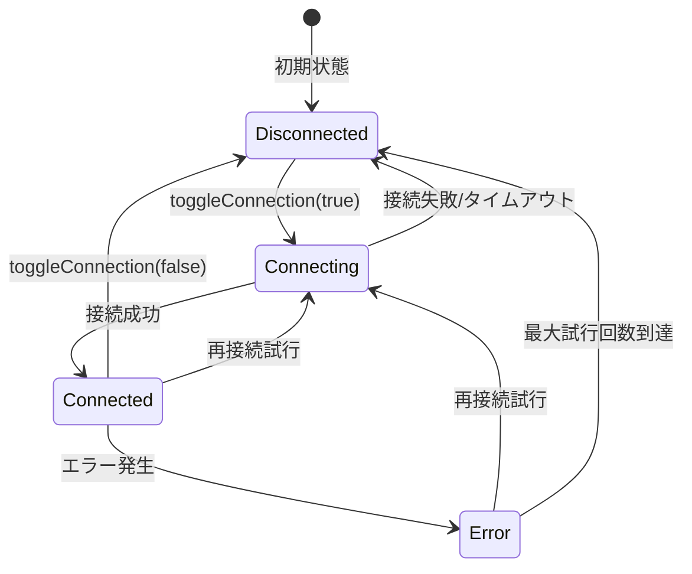

#### Zustand Store構造

```typescript
// settings.ts - 基本的なMQTT設定（localStorage永続化）
{
  mqttEnabled: boolean,                    // MQTT機能の有効/無効（起動時・On/Off切り替え時に参照）
  mqttConnectionStatus: ConnectionStatus,  // 接続状態
  mqttHost: string,                       // ブローカーホスト
  mqttPort: number,                       // ブローカーポート
  mqttClientId: string,                   // 保存用ClientID（未使用）
  mqttProtocol: 'mqtt' | 'websocket',    // 接続プロトコル
  mqttWebsocketPath: string,              // WebSocketパス
  mqttUsername?: string,                  // 認証ユーザー名
  mqttPassword?: string,                  // 認証パスワード
  mqttSecure: boolean,                    // TLS/SSL使用
  mqttReconnectEnabled: boolean,          // 自動再接続
  mqttReconnectInitialDelay: number,      // 再接続初期遅延
  mqttReconnectMaxDelay: number,          // 再接続最大遅延
  mqttReconnectMaxAttempts: number,       // 再接続最大試行回数
}

// mqttBrokerSettings.ts - 拡張設定（localStorage永続化）
{
  sendMode: SendMode,                     // 送信モード
  defaultMessageType: MessageType,        // デフォルトメッセージタイプ
  defaultPriority: Priority,              // デフォルト優先度
  defaultEmotion: EmotionType | null,     // デフォルト感情
  includeTimestamp: boolean,              // タイムスタンプ含有
  includeMetadata: boolean,               // メタデータ含有
}
```

### 設定値の保存場所と管理

#### 既存アプリケーション設定との同等性

**MQTT設定の保存方法は既存のAITuberKit設定保存と完全に同等の処理です：**

| 設定カテゴリ | localStorage キー | 保存方法 | 永続化対象 |
|-------------|------------------|----------|------------|
| メイン設定 | `'aitube-kit-settings'` | Zustand + persist | API、AI、音声、キャラクター等（約140項目） |
| **MQTT基本設定** | `'aitube-kit-settings'` | **同上** | **MQTT接続設定（約12項目）** |
| **MQTT拡張設定** | `'mqtt-broker-extended-settings'` | **同上** | **ペイロードオプション等（6項目）** |
| ホーム画面 | `'aitube-kit-home'` | Zustand + persist | チャットログ、導入画面状態 |
| スライド | `'aitube-kit-slide'` | Zustand + persist | スライド選択状態 |

**既存アプリケーションの設定管理パターン：**
```typescript
// settings.ts - 既存のメイン設定（約680行）
export const settingsStore = create<Settings>()(
  persist(
    (set, get) => ({
      // 初期状態（APIKeys、ModelProvider、Character等）
    }),
    {
      name: 'aitube-kit-settings',           // localStorage キー
      partialize: (state) => ({
        // 永続化対象を明示的に選択（約140項目）
        openAiKey: state.openAiKey,
        googleKey: state.googleKey,
        mqttEnabled: state.mqttEnabled,      // ← MQTT設定も含む
        mqttHost: state.mqttHost,
        // ...
      }),
      onRehydrateStorage: () => (state) => {
        // 復元時の移行処理
        migrateStore(state)
      }
    }
  )
)
```

**MQTT設定の実装パターン（既存と同一）：**
```typescript
// mqttBrokerSettings.ts - MQTT拡張設定
export const useMqttBrokerStore = create<MqttBrokerStore>()(
  persist(
    (set, get) => ({
      // MQTT固有の拡張設定
    }),
    {
      name: 'mqtt-broker-extended-settings', // 分離されたキー
      partialize: (state) => ({
        // 永続化対象を明示的に選択
        sendMode: state.sendMode,
        defaultMessageType: state.defaultMessageType,
        // ...
      }),
    }
  )
)
```

#### 保存場所

**ブラウザのlocalStorage** に永続化されます（既存設定と同一の場所）：

```typescript
// 1. settings.ts - 基本MQTT設定
// localStorage key: "aitube-kit-settings"（既存メイン設定と統合）
{
  mqttEnabled: boolean,                    // MQTT機能On/Off
  mqttConnectionStatus: ConnectionStatus,  // 現在の接続状態（非永続化）
  mqttHost: string,                       // ブローカーホスト
  mqttPort: number,                       // ブローカーポート
  mqttClientId: string,                   // ClientID
  mqttProtocol: 'mqtt' | 'websocket',    // 接続プロトコル
  mqttWebsocketPath: string,              // WebSocketパス
  mqttUsername?: string,                  // 認証ユーザー名
  mqttPassword?: string,                  // 認証パスワード
  mqttSecure: boolean,                    // TLS/SSL使用
  mqttReconnectEnabled: boolean,          // 自動再接続
  mqttReconnectInitialDelay: number,      // 再接続初期遅延
  mqttReconnectMaxDelay: number,          // 再接続最大遅延
  mqttReconnectMaxAttempts: number,       // 再接続最大試行回数
}

// 2. mqttBrokerSettings.ts - 拡張設定
// localStorage key: "mqtt-broker-extended-settings"
{
  sendMode: SendMode,                     // 送信モード
  defaultMessageType: MessageType,        // デフォルトメッセージタイプ
  defaultPriority: Priority,              // デフォルト優先度
  defaultEmotion: EmotionType | null,     // デフォルト感情
  includeTimestamp: boolean,              // タイムスタンプ含有
  includeMetadata: boolean,               // メタデータ含有
}
```

#### 保存・読み出しタイミング

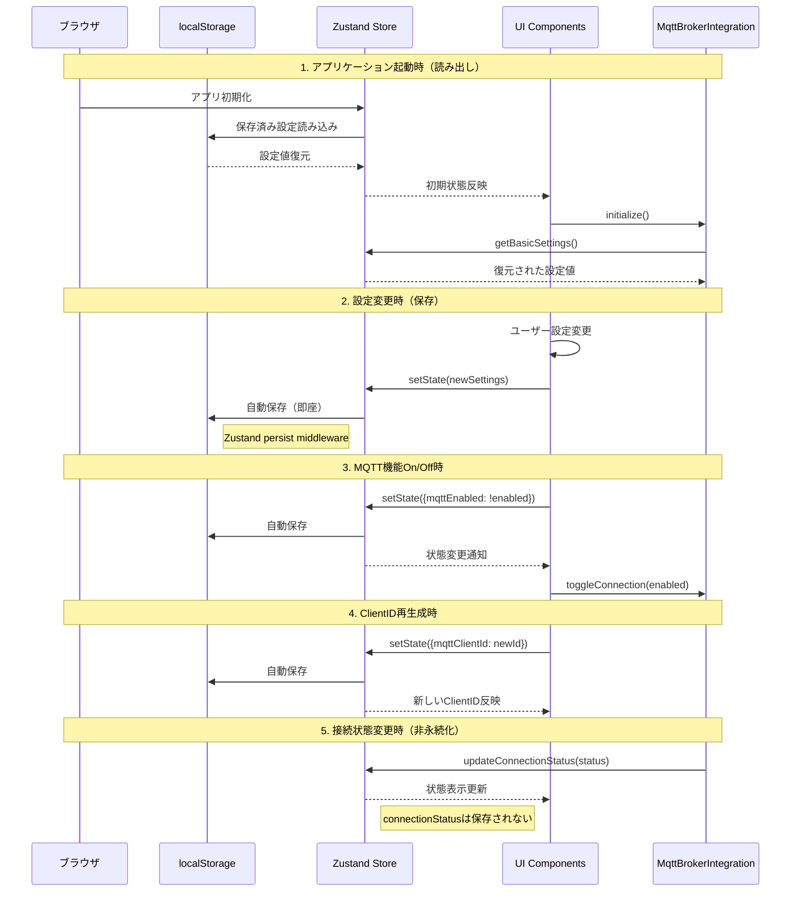

#### 設定値の利用タイミング

**1. アプリケーション起動時**
```typescript
// _app.tsx または初期化時
useEffect(() => {
  // localStorage から設定値を自動復元
  const mqttEnabled = settingsStore.getState().mqttEnabled
  if (mqttEnabled) {
    mqttBrokerIntegration.initialize()  // 保存された設定で自動接続
  }
}, [])
```

**2. MQTT接続時**
```typescript
// MqttBrokerIntegration.ts
public buildConnectionConfig(): MqttConnectionConfig {
  const store = useMqttBrokerStore.getState()
  const basicSettings = store.getBasicSettings()  // localStorage から読み出し
  
  return {
    brokerUrl: store.getBrokerUrl(),               // mqttHost + mqttPort から構築
    clientId: basicSettings.clientId,             // 保存されたClientID
    username: basicSettings.username,             // 保存された認証情報
    password: basicSettings.password,
    secure: basicSettings.secure,                 // セキュア接続設定
    // ...
  }
}
```

**3. UI表示時**
```typescript
// mqttBroker.tsx
const MqttBrokerSettings = () => {
  // Zustand hook による自動購読（localStorage から復元済み）
  const {
    mqttEnabled: enabled,
    mqttHost,
    mqttPort,
    mqttUsername,
    // ...
  } = settingsStore()
  
  // リアルタイムで localStorage の値を反映
  return (
    <input 
      value={mqttHost} 
      onChange={(e) => settingsStore.setState({ mqttHost: e.target.value })}
    />
  )
}
```

**4. 設定変更時**
```typescript
// UI での設定変更
const handleHostChange = useCallback((value: string) => {
  settingsStore.setState({ mqttHost: value })  // 即座に localStorage に保存
}, [])

// 拡張設定の変更
const handleSendModeChange = useCallback((mode: SendMode) => {
  updateMqttBrokerConfig({ sendMode: mode })    // 即座に localStorage に保存
}, [updateMqttBrokerConfig])
```

#### localStorage の実際の構造

**1. aitube-kit-settings（既存のメイン設定と統合）**
```json
{
  "state": {
    // 既存のAI・音声・キャラクター設定（約140項目）
    "openAiKey": "sk-xxx...",
    "anthropicKey": "sk-ant-xxx...",
    "selectedVoice": "aoyama",
    "characterName": "ずんだもん",
    // MQTT設定（既存設定に統合）
    "mqttEnabled": true,
    "mqttHost": "localhost",
    "mqttPort": 1883,
    "mqttClientId": "aituber-550e8400-e29b-41d4-a716-446655440000-1703123456789",
    "mqttProtocol": "websocket",
    "mqttWebsocketPath": "/mqtt",
    "mqttUsername": "user123",
    "mqttPassword": "password123",
    "mqttSecure": false,
    "mqttReconnectEnabled": true,
    "mqttReconnectInitialDelay": 1000,
    "mqttReconnectMaxDelay": 30000,
    "mqttReconnectMaxAttempts": 5
  },
  "version": 0
}
```

**2. mqtt-broker-extended-settings**
```json
{
  "state": {
    "sendMode": "direct_send",
    "defaultMessageType": "speech",
    "defaultPriority": "medium",
    "defaultEmotion": null,
    "includeTimestamp": false,
    "includeMetadata": false
  },
  "version": 0
}
```

#### 設定値の取得方法

```typescript
// MqttBrokerIntegration.ts での設定取得
public async initialize(): Promise<void> {
  const store = useMqttBrokerStore.getState()
  const basicSettings = store.getBasicSettings()
  
  // getBasicSettings() は以下を実行:
  // const settings = settingsStore.getState()  // localStorage から読み出し
  // return {
  //   enabled: settings.mqttEnabled,     // ← ここで mqttEnabled を取得
  //   host: settings.mqttHost,
  //   port: settings.mqttPort,
  //   ...
  // }
  
  if (basicSettings.enabled) {  // mqttEnabled が true の場合
    await this.connect()
  }
}

// UI (mqttBroker.tsx) での設定取得
const { mqttEnabled: enabled } = settingsStore()  // Zustand hook で直接取得

// On/Off切り替え時の更新
const handleToggleEnabled = () => {
  settingsStore.setState({ mqttEnabled: !enabled })  // 直接更新
}
```

#### 注意事項

**非永続化される値：**
- `mqttConnectionStatus`: 接続状態（アプリ起動時は常に 'disconnected'）
- 一時的な UI 状態（エラーメッセージ、テスト結果等）

**セキュリティ考慮：**
- パスワードは平文で localStorage に保存される
- ブラウザの開発者ツールから閲覧可能
- HTTPS 環境での使用を推奨

### 5. エラーハンドリング

#### エラーケースと対処

1. **接続エラー**
   - タイムアウト: 10秒で自動切断
   - 認証失敗: エラーメッセージ表示
   - ネットワークエラー: 再接続試行

2. **再接続戦略**
   ```typescript
   // 指数バックオフによる再接続
   初回: 1秒後
   2回目: 2秒後
   3回目: 4秒後
   ...
   最大: 30秒後
   最大試行回数: 5回
   ```

3. **エラーハンドラー (errorHandler.ts)**
   ```typescript
   export function analyzeMqttError(error: Error): ErrorInfo
   export function formatMqttError(errorInfo: ErrorInfo): string
   export function diagnoseMqttConfig(config: MqttConfig): DiagnosticResult
   ```

### 6. メッセージ処理

#### 受信メッセージの処理フロー

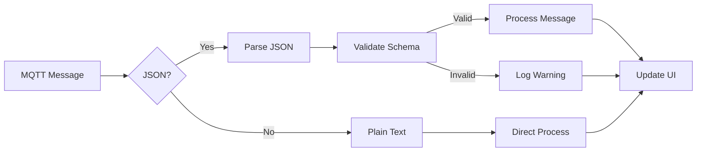

#### メッセージペイロード構造

```typescript
// 構造化メッセージ（JSON）
{
  text: string,           // メッセージ本文
  type: MessageType,      // メッセージタイプ
  priority: Priority,     // 優先度
  emotion?: EmotionType,  // 感情（オプション）
  timestamp?: string,     // タイムスタンプ（オプション）
  metadata?: {            // メタデータ（オプション）
    clientId: string,
    sendMode: SendMode,
    [key: string]: any
  }
}

// プレーンテキストメッセージ
"Hello, World!"
```

### 7. セキュリティ考慮事項

1. **認証情報の保護**
   - パスワードは暗号化せずローカルストレージに保存（注意喚起）
   - HTTPS環境でのみセキュア

2. **ClientIDの安全性**
   - UUIDによりClientIDの推測を防止
   - タイムスタンプによる追跡は可能（プライバシー注意）

3. **TLS/SSL**
   - セキュア接続オプション提供
   - 自己署名証明書は開発環境のみ許可

### 8. パフォーマンス最適化

1. **接続プール**
   - シングルトン実装により接続を再利用

2. **メッセージキュー**
   - 受信メッセージの非同期処理
   - バックプレッシャー対策

3. **監視間隔**
   - 接続状態チェック: 5秒間隔
   - 不要時は監視停止

## MVP版の制限事項

1. **固定設定**
   - トピック: `aituber/speech` (QoS: 2)
   - プロトコル: WebSocketのみ

2. **未実装機能**
   - 複数トピックの購読
   - 動的トピック変更
   - カスタムペイロード設定
   - Willメッセージ
   - Retain機能

3. **UI制限**
   - トピック設定UI非表示
   - ペイロード設定UI非表示

## テスト計画

### 単体テスト

1. **ClientID生成テスト**
   ```typescript
   describe('generateAituberClientId', () => {
     it('should generate unique client IDs', () => {
       const id1 = generateAituberClientId()
       const id2 = generateAituberClientId()
       expect(id1).not.toBe(id2)
     })
     
     it('should follow aituber format', () => {
       const id = generateAituberClientId()
       expect(isAituberClientId(id)).toBe(true)
     })
   })
   ```

2. **接続テスト**
   - モックMQTTクライアントによる接続フロー検証
   - エラーケースの網羅的テスト

### 結合テスト

1. **E2Eテスト**
   - UIからの接続/切断操作
   - メッセージ送受信フロー
   - 再接続シナリオ

2. **負荷テスト**
   - 大量メッセージ受信時の動作
   - 長時間接続の安定性

## 今後の拡張計画

### Phase 2（次期リリース）

1. **トピック管理機能**
   - 複数トピックの購読/購読解除
   - トピックフィルタリング
   - 動的トピック追加/削除UI

2. **ペイロード設定機能**
   - カスタムペイロード構造定義
   - JSONスキーマ検証
   - ペイロード変換ルール

### Phase 3（将来構想）

1. **高度な機能**
   - MQTT 5.0対応
   - 共有サブスクリプション
   - トピックエイリアス

2. **管理機能**
   - 接続履歴
   - メッセージログビューア
   - パフォーマンスメトリクス

## テスト環境設定

### MQTTブローカー設定

```yaml
broker:
  host: 192.168.0.131
  mqtt_port: 1883
  websocket_port: 8083
  websocket_path: /mqtt  # WebSocketエンドポイント
  protocol: websocket  # MVP版はWebSocketのみサポート
  topic: aituber/speech
  qos: 2
  connection_url: ws://192.168.0.131:8083/mqtt  # 完全なWebSocket URL
```

### 音声合成サーバー設定（発話テスト用）

```yaml
tts:
  service: AivisSpeech
  url: http://192.168.0.131:10101
  test_text: "MQTTテストメッセージです"
```

### テスト接続例

```typescript
// テスト用の接続設定
const testConfig = {
  brokerUrl: 'ws://192.168.0.131:8083/mqtt',
  brokerPort: 8083,
  clientId: generateAituberClientId(),
  secure: false,
}

// テスト用のメッセージ送信
const testMessage = {
  text: "MQTTテストメッセージです",
  type: "speech",
  priority: "medium",
  timestamp: new Date().toISOString()
}
```

## 参考資料

- [MQTT v3.1.1 仕様](http://docs.oasis-open.org/mqtt/mqtt/v3.1.1/mqtt-v3.1.1.html)
- [MQTT.js ドキュメント](https://github.com/mqttjs/MQTT.js)
- [AITuberKit アーキテクチャ](./architecture.md)